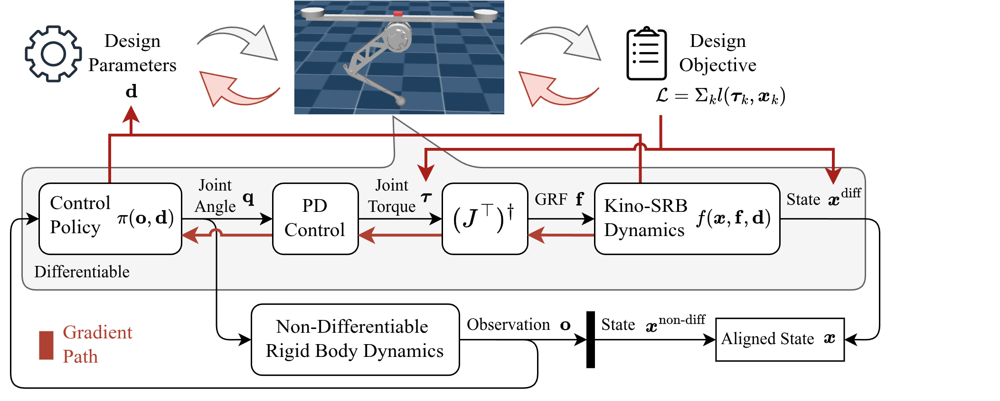
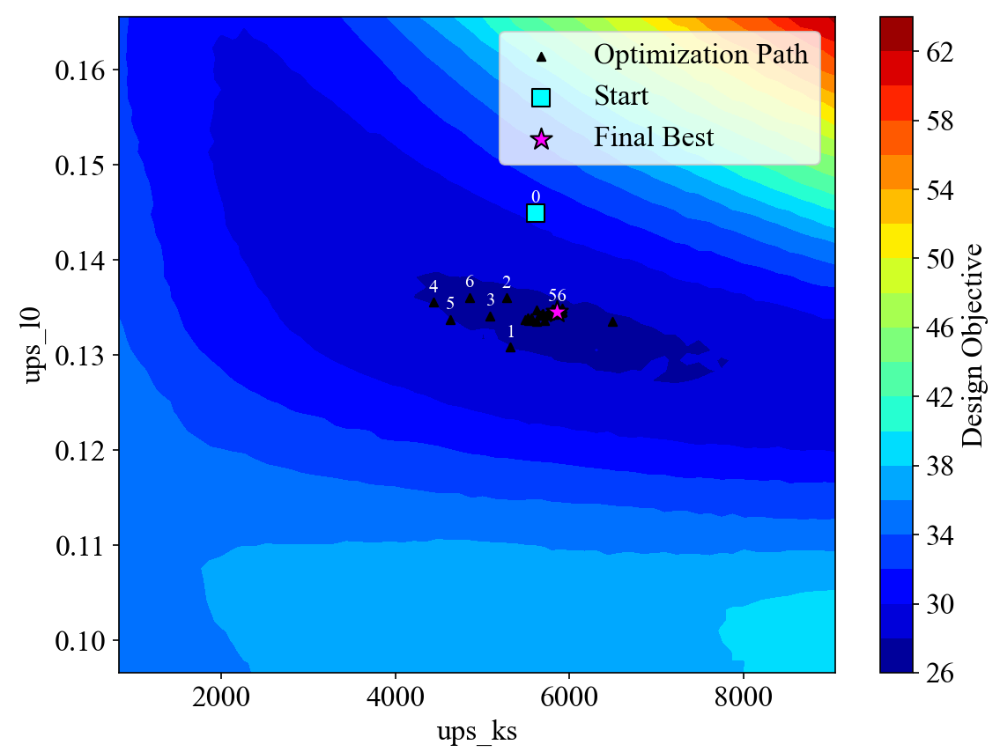
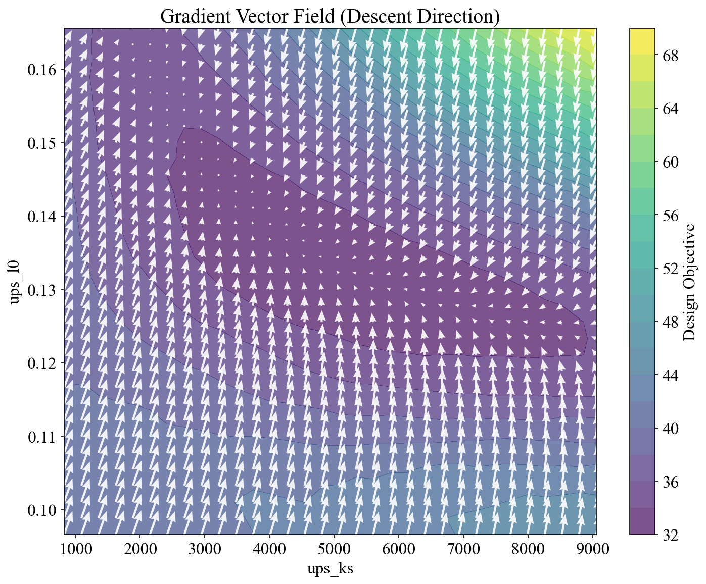

# Differential CoDesign

Differentiable co-design pipeline for the MUPS hopping robot.



## Installation

Install this package locally in editable mode:
```bash
conda env create -f environment.yml
conda activate codesign
pip install -e .
```
This repo also requires [Isaac Gym](https://developer.nvidia.com/isaac-gym) and [arcad_gym](https://github.com/ARCaD-Lab-UM/arcad_gym) to be installed.

## Quick Start

Run unit tests to assert gradients are the same from finite difference (FD) and automatic differentiation (AD) for each CoDesign modules:

```bash
pytest tests/ -v -s
```

Run design optimizations:

```bash
python scripts/run_codesign.py  # Pure gradient descent
python scripts/run_cma_codesign.py  # Pure CMA-ES
python scripts/run_guided_es_codesign.py  # Gradient guided CMA-ES
```

Collect design landscape for `policy_id` configured in `<mups_codesign/config.py>`:
```bash
python scripts/collect_landscape.py
```

Plot latest optimization trajectory over last collected objective landscape:
```bash
python scripts/plot_landscape.py --policy_id rainbow_v6
```


Collect gradient vector field of 2D objective landscape from AD:
```bash
python scripts/collect_gradient_field.py
```

Collect gradient vector field of 2D objective landscape from FD:
```bash
python scripts/collect_gradient_field_fd.py
```

Plot last collected gradient vector field over objective landscape:
```bash
python scripts/plot_gradient_field.py --grad-magnitude 5
```
Use `--grad-magnitude` to scale vector magnitude for minimum overlap.




### Prioritized TODOs:

<details>

- [x] Fix hardcoded design_param_names in mups_robot.py
- [x] Unify changeable parameters with design space parameters
- [x] Fix broken tests and make them unit-testable
- [x] Fix energy calculation to account for time step correctly
- [x] Wrap control loop into a rollout function
- [x] Unify control loop helper for run_codesign and plot_landscape
- [x] Run a test with 4 dim design space with unchanged policy to see if pipeline works
- [x] Implement logger to save important statistics during optimization
- [x] Revamp plot_landscape script to dump one landscape per policy
- [x] Check if landscape match with previous runs
- [x] Retry hacked 4 dim optimization and check tensorboard to see if those make sense
- [x] No need for hopper standalone env and config, instead, use the actual hopper env and config
- [x] We need to plot the episode trajectory of hopper
- [x] Retrain policy with 4 dim design space, tune design range if necessary
- [x] Test NN as an individual block
- [x] What's the role of num_envs in design optimization? Only matter if any domain rand is on.
- [x] Make config actually useful
- [x] Disable awkward printing from isaacgym
- [x] Add unit tests for FD vs AD
- [x] Visualize AD gradient field over landscape
- [x] Visualize FD gradient field over landscape
- [x] Make rollout_control_loop easier to take different combination of params
- [x] Start interfacing with CMA-ES
