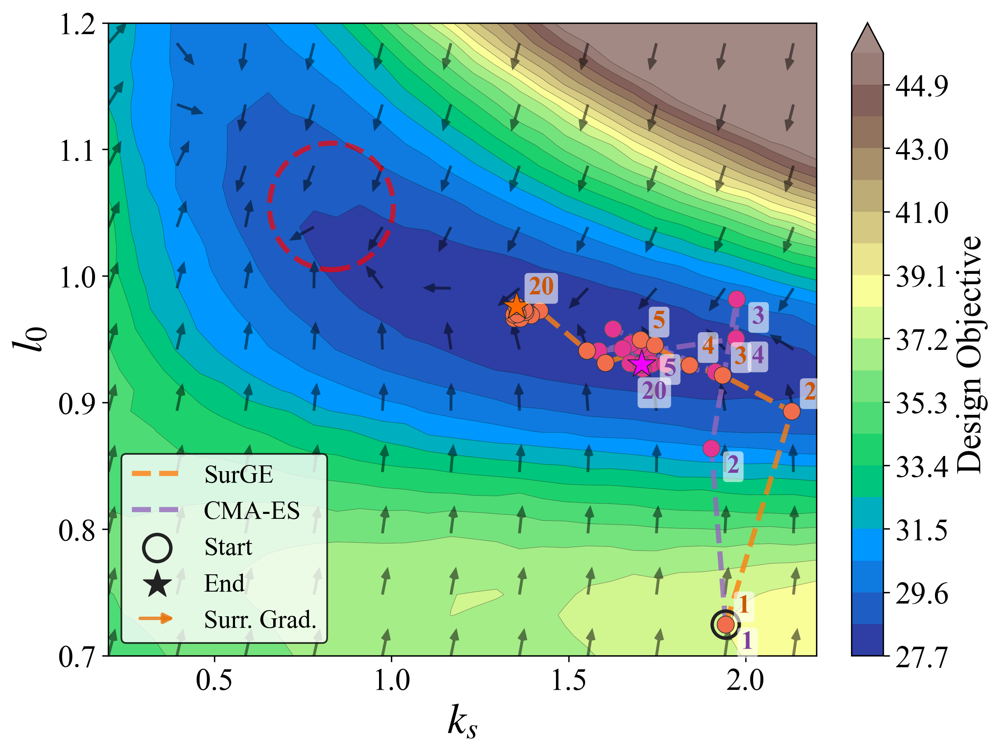
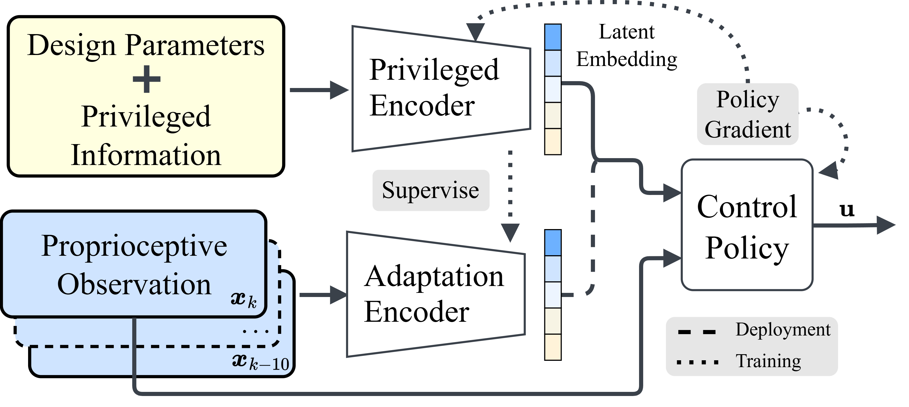

# SurGE

[**Paper**]() (coming soon) | [**Project Page**]() (coming soon) | [**Video**](https://youtu.be/amKPB2cOvBo)

Official implementation of *"SurGE: Surrogate Gradient-guided Evolution for Co-design of Legged Robots with Parallel Elasticity"*.

## TODO
- [ ] Make sure we have a script to reproduce the main results in the paper
- [ ] Unify occurrence of naming of hopper e.g. hopper-v2, mups, hopper, mups_v2, etc.
- [ ] Rename `run_meanshift_es.py` to `run_surge.py`
- [ ] Setup website in another branch

## Overview


SurGE jointly optimizes the spring design and control policy of legged robots with parallel elasticity.
To recover gradient information despite this non-differentiability, SurGE differentiates a surrogate pipeline, a kinodynamic single-rigid-body model paired with a design-aware policy, and injects the resulting surrogate gradient into CMA-ES through a mean shift with cosine-annealed decay. This converges faster and more reproducibly than pure gradient-based or pure evolutionary search, with the improvement transferring to hardware.


## Installation

### Dependencies
* Ubuntu 22.04
* Python 3.8
* Isaac Gym (Preview 4)

### Environment Setup

1. Clone the repo:
   ```bash
   git clone https://github.com/ARCaD-Lab-UM/mups-codesign.git
   cd mups-codesign
   ```
2. Create and activate the conda environment:
   ```bash
   conda env create -f environment.yml
   conda activate codesign
   ```
3. Install Isaac Gym (Preview 4) into this env per [NVIDIA's instructions](https://developer.nvidia.com/isaac-gym).
4. Install the co-design code (editable):
   ```bash
   pip install -e .
   ```

The editable install builds all three packages from `src/`: `mups_codesign`, `legged_gym`, and `rsl_rl`.


## Quick Start

A pretrained `checkpoints/rainbow_v7` design-aware policy is provided for quick testing.

### Co-design with SurGE
```bash
python scripts/run_meanshift_es.py --seed 1
```

### Baselines

```bash
python scripts/run_codesign.py       # GD
python scripts/run_cma_codesign.py   # vanilla CMA-ES
```

### Visualization & Analysis



```bash
python scripts/collect_landscape.py                          # collect objective landscape
python scripts/collect_gradient_field.py                     # collect gradient field
python scripts/collect_gradient_field_fd.py                  # collect gradient field (finite difference)
python scripts/plot_landscape.py --policy_id rainbow_v7      # plot landscape
python scripts/plot_gradient_field.py --grad-magnitude 5     # plot gradient field
```


## Train a Design-Aware Locomotion Policy



A pretrained policy ships in `checkpoints/`. To train a new one:
```bash
python scripts/train_policy.py --task hopper
python scripts/play_policy.py --task hopper    # visualize the latest run
```

> [!NOTE]
> To use a freshly trained policy in co-design, set `policy_root="logs/hopper"` and `policy_id` to the new run directory name in `src/mups_codesign/config.py` (defaults: `policy_root="checkpoints"`, `policy_id="rainbow_v7"`).


## Code Structure

The co-design logic lives in `src/mups_codesign/`, alongside our customized RL framework.

```
src/mups_codesign/         # core co-design package
  config.py                # configuration
  design_space.py          # design parameters and bounds
  design_objective.py      # design objective
  mups_robot.py            # differentiable Kino-SRB surrogate
  mups_spring.py           # differentiable UPS spring model
  optim_helper.py          # rollout and gradient engine
  data_logger.py           # logging
  vis_helper.py            # plotting
src/legged_gym/            # customized legged-gym (hopper simulation env)
src/rsl_rl/                # customized rsl-rl (RL framework)
```

## Citation

If you find this code useful for your research, please consider citing our paper:
```bibtex
@article{zhuang2026surge,
  title={SurGE: Surrogate Gradient-guided Evolution for Co-design of Legged Robots with Parallel Elasticity},
  author={Yulun Zhuang, Yue Qin, Justin Lu, Zelin Shen, Yichen Wang, Sicheng He and Yanran Ding},
  journal={arXiv preprint (coming soon)},
  year={2026}
}
```
